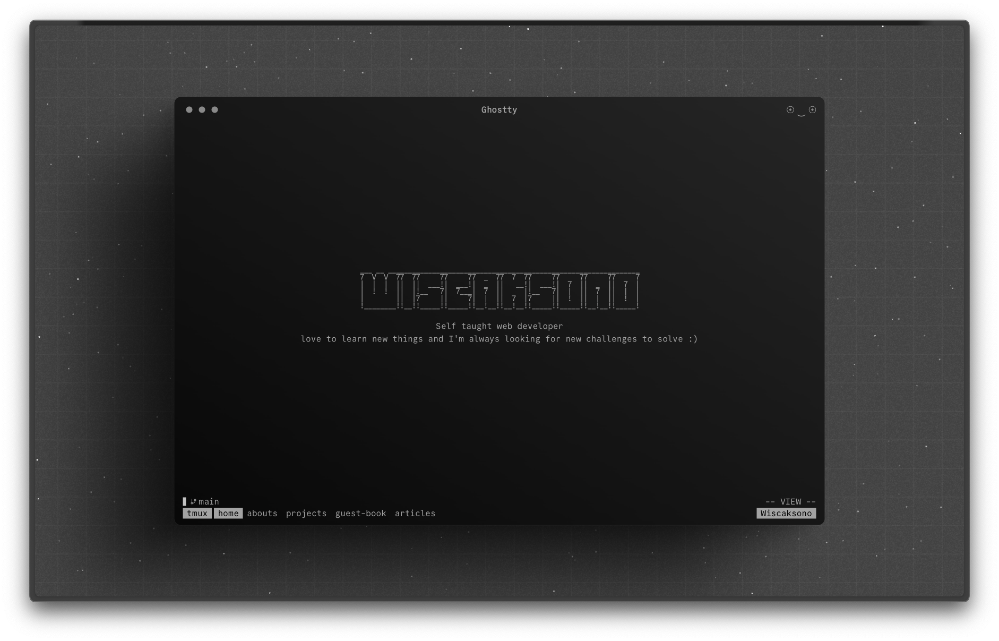

# Wisnu's Homepage

## Preview



## Stack

- [Svelte Kit](https://svelte.dev/) - The fastest way to build Svelte apps.
- [Lucia Auth](https://lucia-auth.com/) - Authentication from scratch.
- [mdsvex](https://mdsvex.pngwn.io/) - Markdown preprocessor.
- [Drizzle ORM](https://orm.drizzle.team/) - Drizzle ORM is a headless TypeScript ORM with a head. 🐲
- [Tailwind CSS](https://tailwindcss.com) - A utility-first CSS framework packed with classes that can be composed to build any design, directly in your markup.

## Running Locally

```bash
git clone https://github.com/wiscaksono/wiscaksono-sv
cd wiscaksono-sv
cp .env.example .env
pnpm install
pnpm dev
```

## License

1. You are free to use this code as inspiration.
2. Please do not copy it directly.
3. Crediting the author is appreciated.
