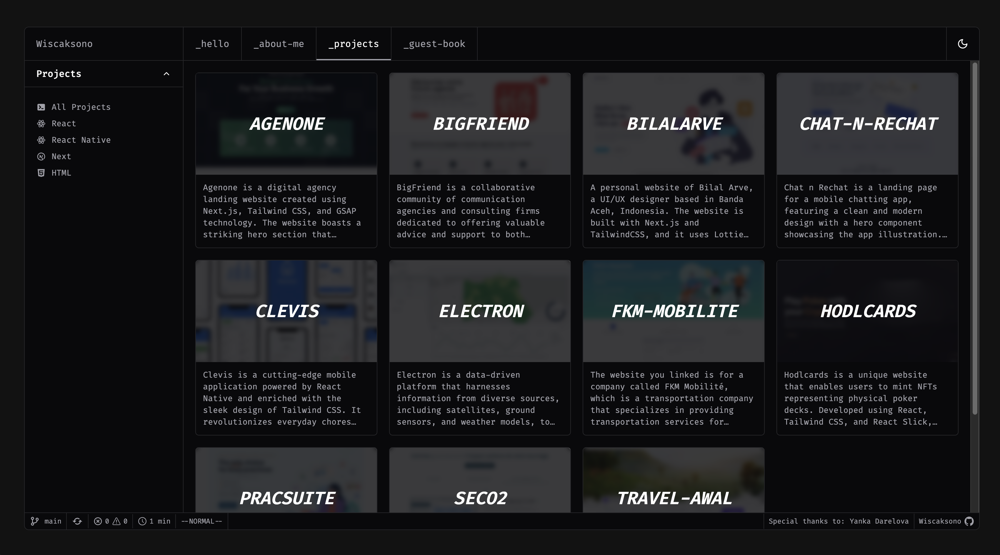
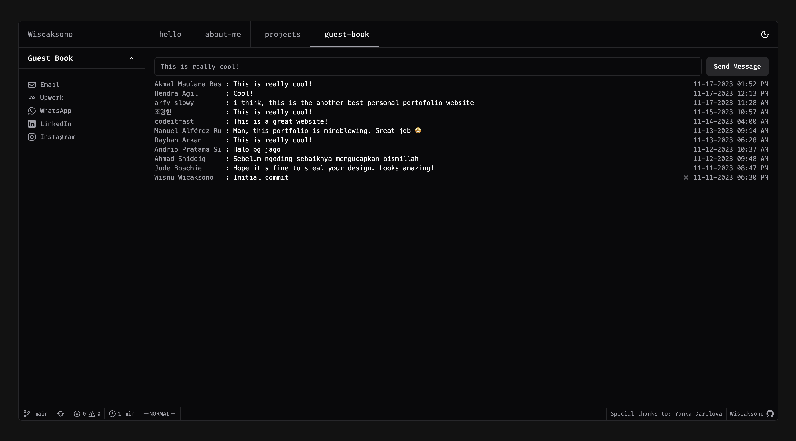
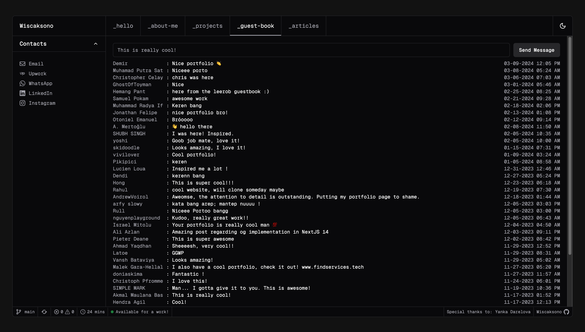
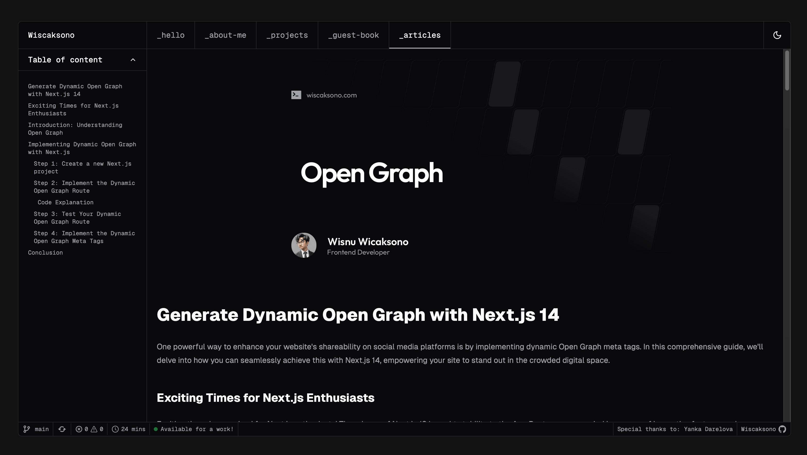

# Wisnu's Homepage

## Preview







## Stack

- [NextJS 15](https://nextjs.org) - Next.js is a React framework for building full-stack web applications
- [TailwindCSS](https://tailwindcss.com) - A utility-first CSS framework packed with classes that can be composed to build any design, directly in your markup.
- [Next Auth](https://next-auth.js.org) - NextAuth.js is a complete open-source authentication solution for Next.js applications.
- [Prisma](https://www.prisma.io) - an open-source ORM that drastically simplifies data modeling, migrations, and data access for SQL databases in Node.js and TypeScript.

## Running Locally

This application requires Node.js v18.17+.

```bash
git clone https://github.com/wiscaksono/wiscaksono-site
cd wiscaksono-site
pnpm install
pnpm dev
```

Create a .env file similar to .env.example.

## License
1. You are free to use this code as inspiration.
2. Please do not copy it directly.
3. Crediting the author is appreciated.
